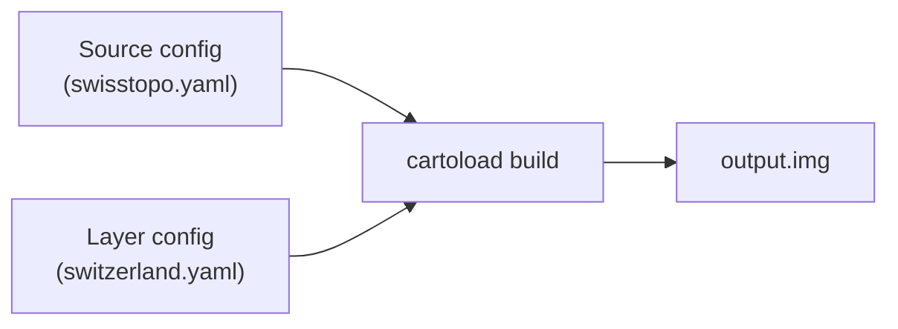

# Configuration

cartoload uses two config files that work together: a **source** config that defines where to get geodata, and a **layer** config that defines what to build from it.

## How it works



1. **Source config** defines one or more geodata providers (e.g., a WMTS tile server, a STAC catalog for GeoTIFFs). Each source gets an ID.

2. **Layer config** defines the map area, zoom levels, and which source to use. Layers reference source IDs from the source config.

3. **Build** combines both — cartoload downloads tiles from the source and exports them into a Garmin IMG file.

## Minimal example

**Source config** (`sources.yaml`):

```yaml
sources:
  my_tiles:
    type: wmts
    url_template: "https://example.com/{layer}/{z}/{x}/{y}.png"
    attribution: "© Example"
```

**Layer config** (`layers.yaml`):

```yaml
bounds:
  west: 7.4
  east: 7.6
  south: 46.9
  north: 47.0

layers:
  my_map:
    name: "My Map"
    type: raster
    source: my_tiles        # references the source ID above
    wmts_layer: topo
    zoom_levels: [10, 12, 14]
    exporter: garmin_img
    output: my_map.img
```

**Build**:

```bash
cartoload build -S sources.yaml -L layers.yaml -l my_map
```

## Detail pages

- [Sources](sources.md) — all source types and their options
- [Layers](layers.md) — layer definition, bounds, zoom levels, exporters, composite layers
